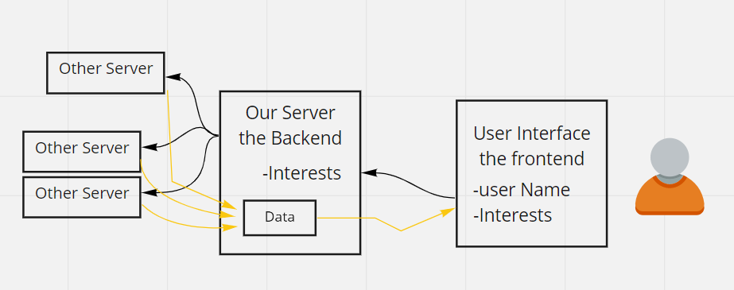

# Explorest-Backend

It's a unique website for users all around the world to have the ability to explore and go through different kinds of genres using our website
Our website gives u the ability to search through ur favorite topic wether u like Cooking , Fashion , Makeup , Desserts , Toys for Kids , Quotes ... etc
and favoriting your topic at our website to check it again easily
Our website Helps users to reach their favorite matters with its updates as part of knowledge and entertainment
We are presenting as MVP our WireFrame and the organization and team name for now

# Team Members

## Bayan Qutshan (TeamLeader)

I'm Electrical Engineer, I've got my degree from JUST. I have four years of experince in Industrial Automation feild. Github account

## Mohammad baker

hello ever one my full name is Mohammad baker I am 23 years old fresh graduation mechanical engineer from Jordan university of since and technology.

## Reem Khalil

My name is Reem Khalil i Studied Civil Engineer at Luminus Technical University College (LTUC)

## Sam alhaj

26 years old,translator, graduated at Zarqa private university

## Yahia Labib

I am Yahia Labib, I am a mechanical engineer I worked in automobile maintenance for one year and now I am taking a coure in software devloping however,I believe that programing is a competitive and challenging environment where I can find myself, achieve my ambition and use my skills.

## Yousef Mohammad Jariry

A Software engineering fresh graduate from the hashemite University.

# Project WireFram

